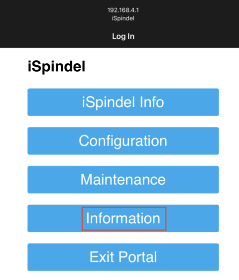
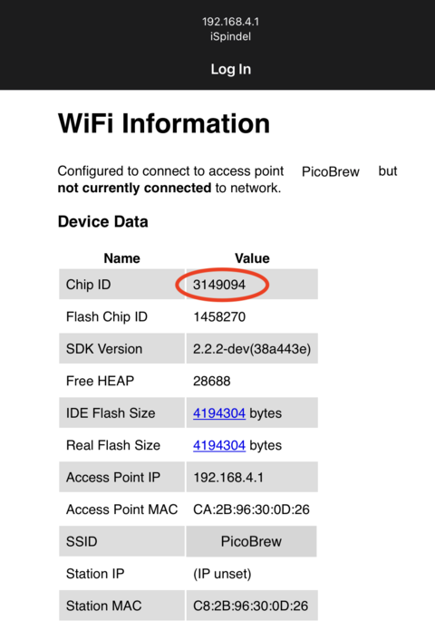
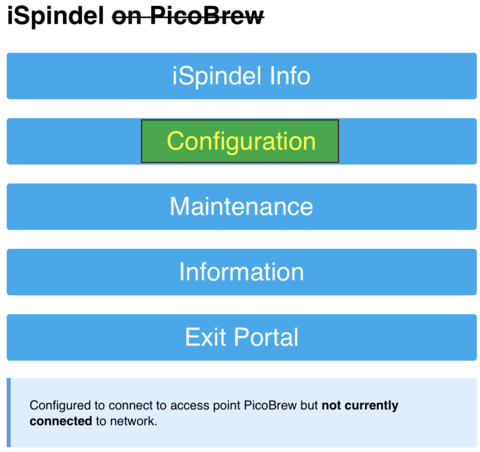
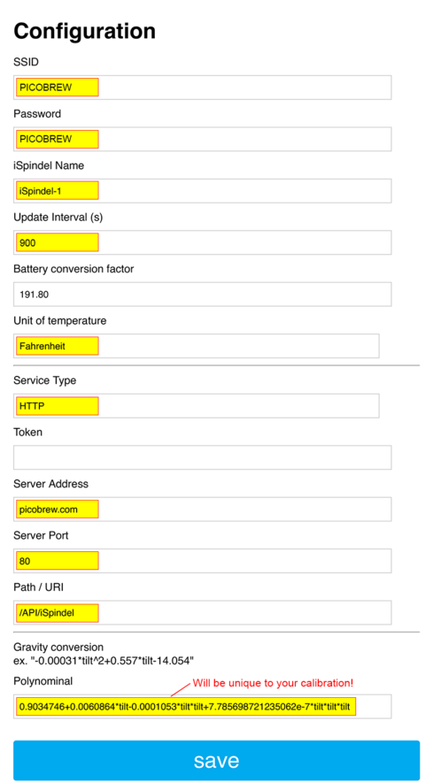
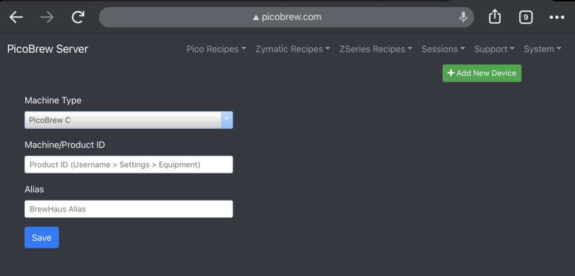

# Using iSpindel with picobrew_pico server

## General Steps for Connecting to iSpindel Access Point
  * Fully charge your iSpindel
  * Turn iSpindel on
  * Put the iSpindel into Access Point (AP) mode by pressing the RESET button on the Wemos D1 rapidly three times
      * The STATUS LED on the Wemos D1 should blink briefly approximately once per second
  * Join your computer/tablet/phone to the iSpindel AP
      * iSpindel AP will broadcast its SSID as "iSpindel"
      * No password is required      

## Configuring iSpindel for Use with Server

### Step 1: Determine the iSpindel's Unique Device ID
  * Once connected to the iSpindel's AP, open a web browser on your device and navigate to "http://192.168.4.1"
    * You should see a page similar to the following:
    

    * Click on the **Information** tab highlighted in red
    * You should see a page similar to the following
    
    * Note the Chip ID, outlined in red. This value will be used to setup an alias in the server's device listings. Once noted, press your browser's BACK button to return to the iSpindel's Configuration Page.

### Step 2: Setup the iSpindel for Server Communication
  * You should see a page similar to the following:
  
    * Note: in the image above PicoBrew has stikethrough because this iSpindel has been previously connected to the PICOBREW server.

  * After clicking the Configuration tab (as highlighted above) you will see a page similar to the following

  

  * On this page, enter the highlighted settings from above:
      * "PICOBREW" into the **SSID** field
      * "PICOBREW" into the **Password** field (or the WiFi password for your Pi server if you have changed it)
      * Enter a unique nickname for your iSpindel in the **iSpindel Name** field
      * Set the **Update Interval (s)** field - this is how often, in seconds, the iSpindel will report data to the server. Since fermentation will be
      tracked over many days, a setting of 15-30 minutes (900-1800 seconds) is more than adequate and will help preserve the iSpindel's battery for
      long fermentation sessions. For testing with the server, a shorter interval may be used and changed later.
      * Set the **Temperature** field to "Fahrenheit" as this is what the server plots
      * Set **Service Type** field to "HTTP"
      * In the **Server Address** field enter "picobrew.com"
      * Set the **Server Port** to 80
      * Enter "/API/iSpindel" in the **Path / URI** field
      * Enter the **Polynomial** equation derived from your calibration of the iSpindel. *This polynomial will be unique for your iSpindel. Be careful not to exceed 100 characters for this entry or the data will not be correctly reported for the gravity.*
      * Click **Save** to save your settings and reboot the iSpindel. It should then connect to your Pi server and start reporting data at the interval you've set previously.

## Setup the Server Devices Page
Now that your iSpindel is configured and connected to your server, let's add it to the server's device list. On a browser connected to the server's AP, open the server. Under the **System** pulldown menu, select **Devices**. After clicking **+ Add New Device** you should see a page similar to this:

Perform the following steps:
  * Under the **Machine Type** pulldown select *iSpindel*
  * In the **Machine/Product ID** box, enter the Chip ID value from Step 1 above (in the example shown this value is 3149094)
  * In the Alias box, add any fun or useful name you'd like.
  * Click **Save**

## Additional References

The iSpindel is an Open Source project. The repository may be found at https://github.com/universam1/iSpindel

The "Easy Method" for calibrating your iSpindel is demonstrated in this video.

To determine your calibration polynomial, you can use this online tool: http://www.ispindel.de/tools/calibration/calibration.htm

A good general reference with lots of instructional videos for iSpindel can be found here: https://www.OpenSourceDistilling.com/iSpindel

That's it! Have fun monitoring your fermentation and go make some great beer!
